# ServiceNow Integration with Cisco ISE

## OVERVIEW

This guide is intended to show how to allow the ServiceNow platform to use information from ServiceNow's CMDB to update endpoint records within ISE. This guide will focus on the following use case:

## USE CASE:

A customer has an inventory of their computers in ServiceNow and would like to ensure that only those computers are allowed access to the network. ServiceNow will therefore inform Cisco ISE of the status of computer objects and ISE will have a policy to either drop ping (default) or allow access (if Computer is in the Inventory). In this case, the ServiceNow database will use the Status field with a value of "Installed"; to indicate a device as being in the inventory (see screenshot):


v1.0
--Update ISE endpoints with Custom Attributes in response to SNOW Network Adapter INSERT/UPDATE actions
v2.0
--Delete ISE endpoint in response to SNOW Network Adapter DELETE action
--Create ISE endpoint in response to ‘Network Adapter’ INSERT action if MAC address does not already exist in ISE

## REQUIREMENTS:

- ISE v2.7 or later (screenshots are ISE 3.1)
- ServiceNow Instance (Orlando or later)
- ServiceNow MID-Server with access to ISE PSN (TCP 80/443/9060)
  - Instructions on how to install a MID Server can be found [here](https://docs.servicenow.com/bundle/quebec-servicenow-platform/page/product/mid-server/concept/mid-server-installation.html)

## OUTLINE:

1. Create ERS user account within ISE
2. Enable ERS Gateway within ISE
3. Create Custom Attributes within ISE
4. Create new Policy Conditions and AuthZ Profile
5. Create MID Server app / Bind App to MID Server on Prem
6. Create the REST API queries in ServiceNow
  - Get_GUI_By_MAC
  - Get_Endpoint_Details
  - Put_Endpoint_Update
  - CREATE_Endpoint
  - DELETE_Endpoint
7. Script Automation within ServiceNow (Script Class and Business Rule)
8. Testing the Overall Solution

## STEP 1. Create ERS Account in ISE

From the ISE Admin portal, navigate to Administration -> System -> Admin Access -> Administrators -> Admin Users and click on "Add" -> "Create an Admin User"

Assign this user the "ERS Admin" role and click Submit


## STEP 2. Enable ERS Gateway within ISE

Navigate to Administration -> System -> Settings -> API Settings

Switch to the "API Service Settings" tab and enable the ERS (Read/Write) button and click "Save".

NOTE: Though not required for this tutorial, the screenshot below also shows OpenAPI enabled as well.


## STEP 3. Create Custom Attributes in ISE

Navigate to Identity Management -> Settings -> Endpoint Custom Attributes and create three conditions:

In our scenario, we will create three new attributes:
**InventoryStatus** (Boolean) – the "true/false" value for whether or not an endpoint is in the inventory
**SerialNumber** (string) – this value will store the SerialNumber details from records in ServiceNow
**SerialSource** (string) – (optional) this value will store "ServiceNow" as the source to distinguish the record change from other 3rd party integrations or manual modification


Click "Save" to save your changes.

To verify that these new attributes have now been added to the ISE endpoint database, navigate to Context Visibility -> Endpoints and select a random mac address. In this case, we've selected our test MAC address of BB:BB:BB:BB:BB:BB

Under Attributes, click the Custom Attributes tab

 

NOTE: By default these new values will be blank on all endpoints, including the Boolean "InventoryStatus". This will become relevant later in the tutorial.

## STEP 4. Create New Authorization Conditions / AuthZ Profile

Navigate to Policy -> Policy Sets and we will create two rules (a permit and a deny rule) using the value of the new "InventoryStatus" custom attribute that will be populated by ServiceNow. When adding the condition for the each rule, you can search the Attribute field to quickly find the "InventoryStatus" field.


**NOTE: Since the default value for the "InventoryStatus" field for all endpoints is blank, these rules would need to target specific device types (Workstations, etc.) to avoid blocking all devices when this feature is enabled.**

The resulting rules should look like the following:


In this example, the AuthZ rule "DROP_PING" pushes a dACL that drops PING traffic for the workstation. However, this could be customized in a variety of ways including a redirect to a splash page that informs the user their device is not in the inventory.

## STEP 5. Create New MID Server Application / Bind App to MID Server on Prem

In ServiceNow, navigate to MID Server -> Applications.

Create the new Application in ServiceNow ("ISE-ERS") and bind it to the MID-Server (ex. "ISE_mid_server")


This will be referenced later


## STEP 6. Create the REST API Queries in ServiceNow

We now need to recreate the API calls into the ServiceNow API engine. To do this, navigate to Outbound -> REST Message and click "New". This will be the basis of all ISE queries so name it something accordingly:

**Name**: ISE-SVR \
**Accessible From**: This application only \
**Authentication – Type**: Basic \
**Endpoint**: https://<ISE>:9060/ers/config \


Click the search button next to Basic Auth Profile. Click "New" to create a new credential.


Here you will put in the ERS credentials that were created in ISE during step 1. Then click submit


Click on the HTTP Request tab and add the key "Accept" with value "application/json"


Now that the basic message format is created, we will create the individual calls:

### Create a new HTTP Method called "Get_GUID_By_MAC"

  1. Set the Endpoint HTTP method to be https://<ISE>:9060/ers/config/endpoint
  2. Set Authentication to "Inherit from parent" 
  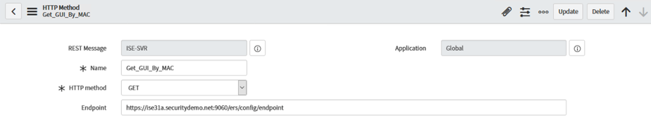
  3. Click the HTTP Request tab. For Use MID Server, click the search button to select your MID Server instance within ServiceNow that will run this request.
  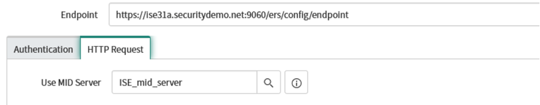
  4. Since HTTP headers are inherited from parent, we don't need to define them in this request.
  5. Under the HTTP Query field, double-click to Insert a new row. For the name type "filter" and for the value, type "mac.EQ.${mac}". 
  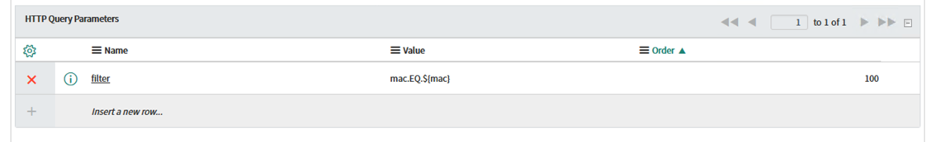
  This value will reference a variable that we will now define.

  6. Under Variable Substitutions, click New. In the next screen, enter "mac" for the name, leave Escape Type to "no escaping" and set the test value to our example MAC address of BB:BB:BB:BB:BB, and then click Submit. 
  
  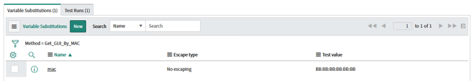
  7. Now we can perform a test run of the MID server communication to the ISE PAN via ERS call. Under Related Links, click the "Test" button.
  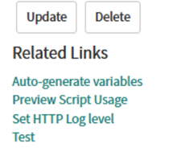

  After a few moments, a new screen displays the Test Results including the GUID value (copy this returned output). 
  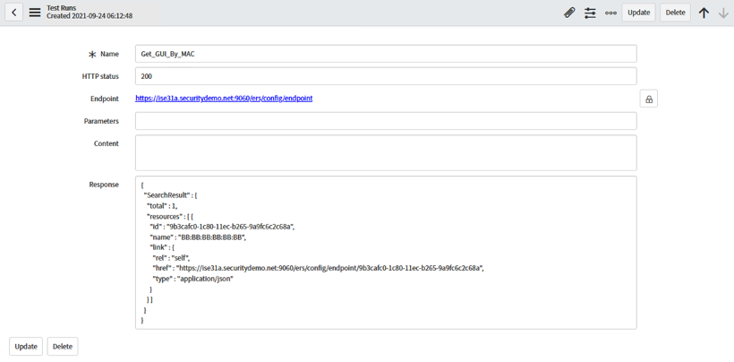

  Find the GUID for the MAC is returned, "9b3cafc….". Copy this value for the next step.

### Create new HTTP Method Called "Get_Endpoint_Details"

  1. Set the following values (replicating steps from the previous method:
  **Name**: GET_Endpoint_Details
  **HTTP Method**: GET
  **Endpoint**: https://<ISE>:9060/ers/config/endpoint/${GUIDendpoint}
  **Authentication Type**: Inherit from Parent
   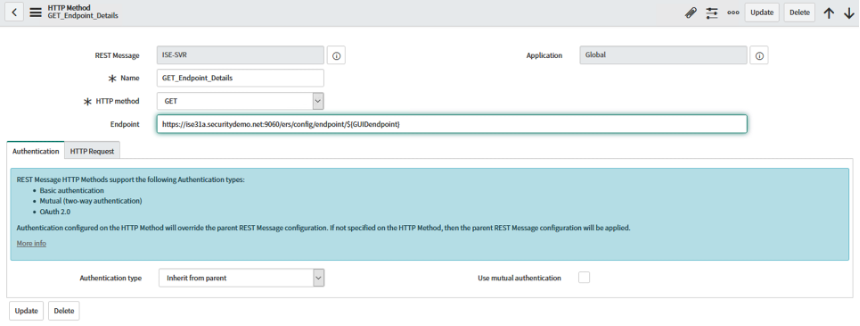

  2. Click the HTTP Request tab and ensure the appropriate MID server is selected.
   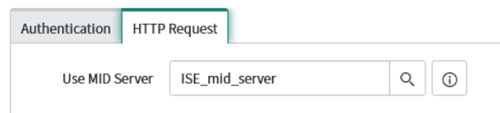

  3. Under variable Substitutions, click New. In the next screen, enter the following:
  **Name**: GUIDendpoint
  **Test Value**: <sample GUID for example MAC from above>
   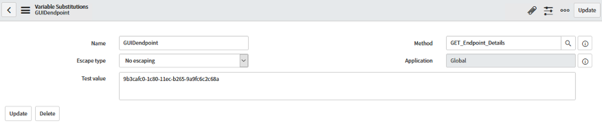

  4. Click the "Test" button under Related Links and confirm the output looks like the following:
   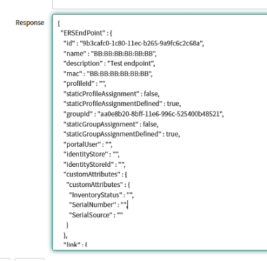

### Create new HTTP Method called "PUT_Endpoint_Update"

  1. Set the following values (replicating steps from the previous method:
  **Name**: "PUT_Endpoint_Update"
  **HTTP Method**: "PUT"
  **Endpoint**: https://<ISE>:9060/ers/config/endpoint/${GUIDendpoint}
  **Authentication Type**: Inherit from Parent

  2. Click the HTTP Request tab and ensure the appropriate MID server is selected.
  
  Under HTTP Headers, add a new field of "Content-Type" and value "application/json"
  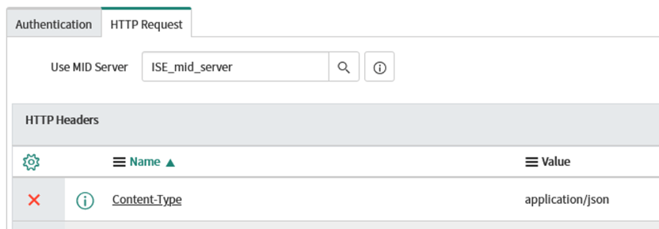
  
  3. Under HTTP Query Parameters, add the following into the "Content" window and click Update:
  ```json
  {
    "ERSEndPoint": {
      "id": "${GUIDendpoint}",
      "customAttributes":{
        "customAttributes" :{
          "InventoryStatus" : ${InventoryStatus},
          "SerialNumber": ${SerialNumber},
          "SerialSource": "${SerialSource}"
        }
      }
    }
  }
  ```
  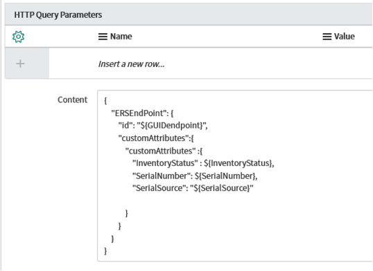
  
  4. Scroll down to the Variable Substitutions section. Here we will define (4) variables that will be used in this query (referenced in the code from the previous step):
  **Name**: GUIDendpoint, **value** = GUID **value** from previous query 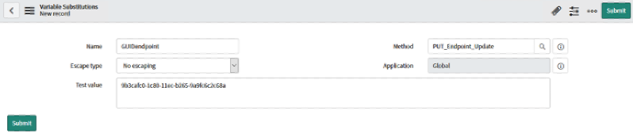
  **Name**: Inventory Status, **value** = true
  **Name**: SerialNumber, **value** = 987654 (Serial # different than Postman example)
  **Name**: SerialSource, **value** = ServiceNow
  
  The end result should look like this 
   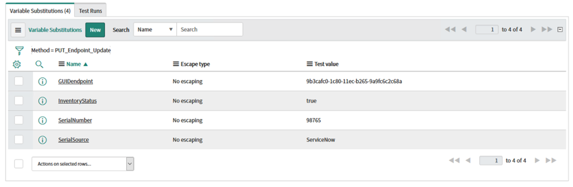

  5. Click the "Test" button under Related Links. The output should look like the following:
   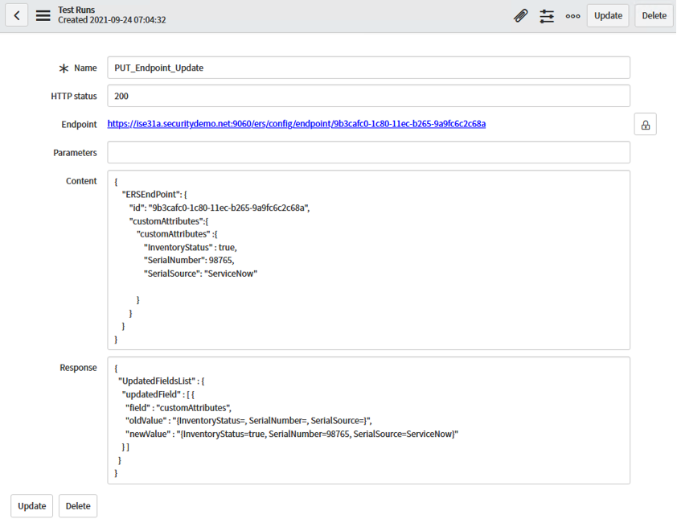

### Verify ServiceNow + ISE Integration
To verify the integration worked correctly, once again navigate to Context Visibility -> Endpoints and pull up the same endpoint to see the attributes updated:
 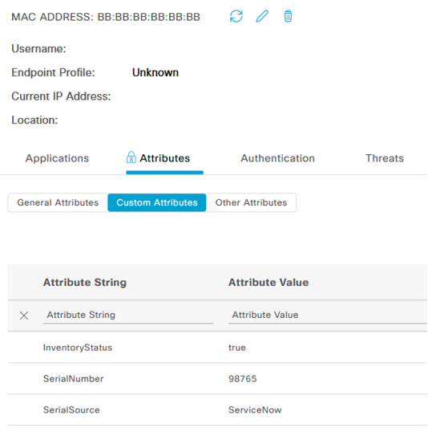

## STEP 7. Script Automation within ServiceNow

Now that we have successfully tested the REST API calls from ServiceNow to update ISE, we need to automate this process based on ServiceNow workflows. To do this, we need to build two components: a **Script Class**, and a **Business Rule**.  The **Script Class** accepts details from the CMDB, calls the REST messages, and parses the output.  The **Business Rule** defines what actions within ServiceNow will trigger the **Script Class**.

  1. Define the ServiceNow Script Class
  Navigate to "System Definition -> Script Includes" and click "New", name it "ISE_Helper" , select the Accessible from "This Application scope only", check the box for "Active", and then use the script for "ISE Helper" located in this repo. The result should look similar to the screenshot below:
 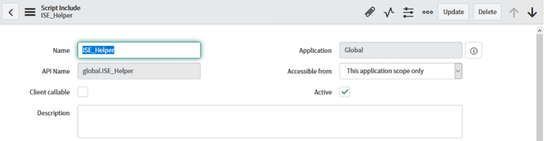

  2. Define the ServiceNow Business Rule
  In this scenario, we want the ServiceNow process to run whenever a new Network Adapter entry is added to the ServiceNow CMDB. Other options can be selected per use case.
  
  Navigate to "Business Rules" and click "New". Populate the following fields:
  **Name**: ISE_Network_Adapter
  **Active**: Enabled
  **Advanced**: Enabled
  **When to Run**: When "After" an "Insert"
  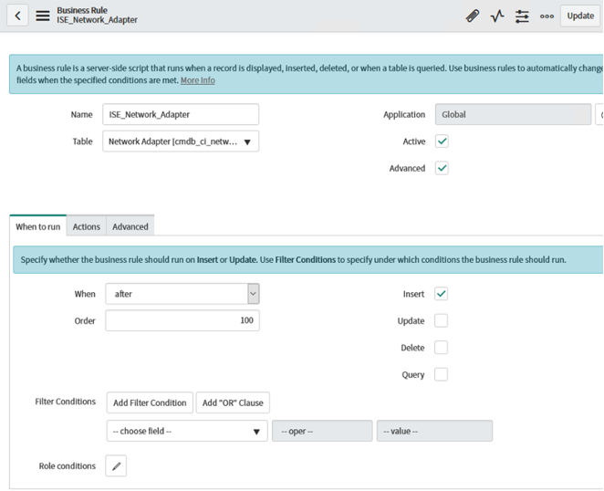

  Click on the "Advanced" tab and add script labeled "ISE_Network_Adapter" located in this repo.  This script will use the information from the Network_Adapter table, send it to the Script Class, and then return the results.

## STEP 8. Testing the Overall Solution

Using our test MAC address from before, let's go back to the ISE dashboard and remove the custom attributes that exist for our test device, BB:BB:BB:BB:BB:BB.

Navigate to Context Visibility -> Endpoints -> select MAC address -> edit endpoint. Open Custom Attributes, and click the small "trash can" icon for each of the three attributes to clear them. Then click Save.
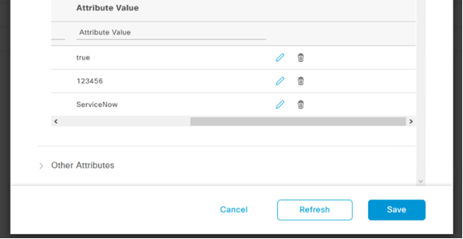 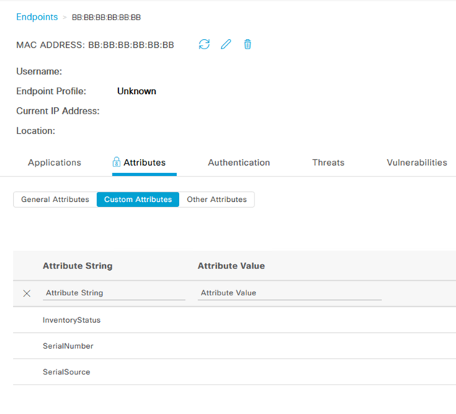

In ServiceNow, navigate to the Configuration -> Computers window to view the active endpoints in the CMDB.

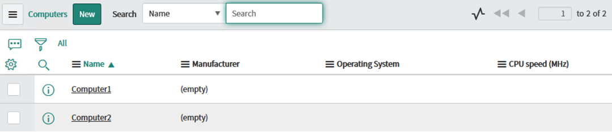

For our example, we will use "Computer1". Click on the computer name to open the Computer record.

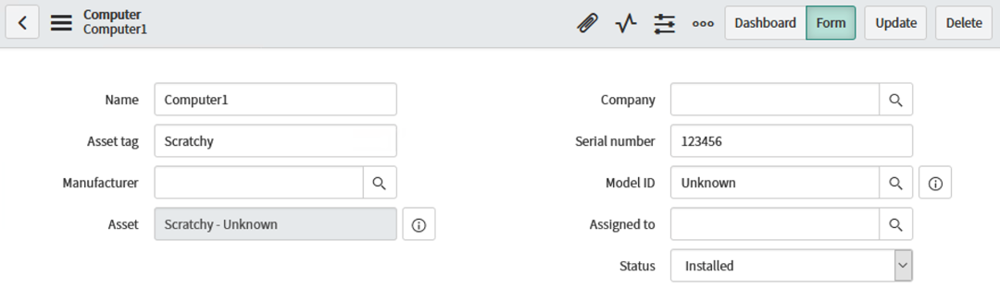

**NOTE**: This computer is currently in an "Installed" status and has a serial number of "123456".

Scroll down to the Network Adapters section. This section shows all of the associated MAC addresses with this workstation. In this case, there are no MAC addresses associated to this endpoint, so we will add one.

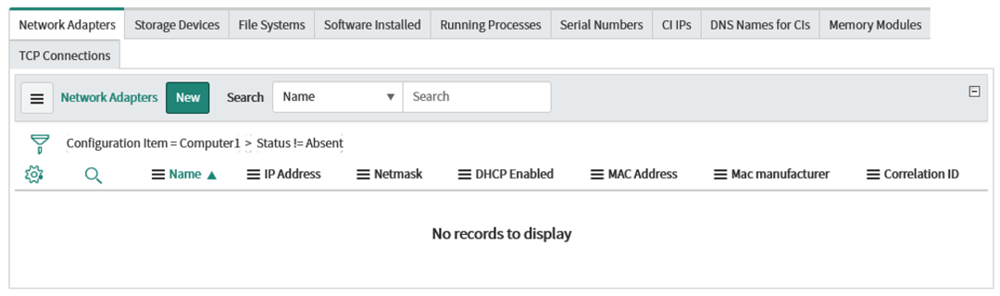

Click "New" and input the value of "BB:BB:BB:BB:BB:BB" for the MAC address field. The other fields are not necessary to modify at this time. Click the "Submit" button.

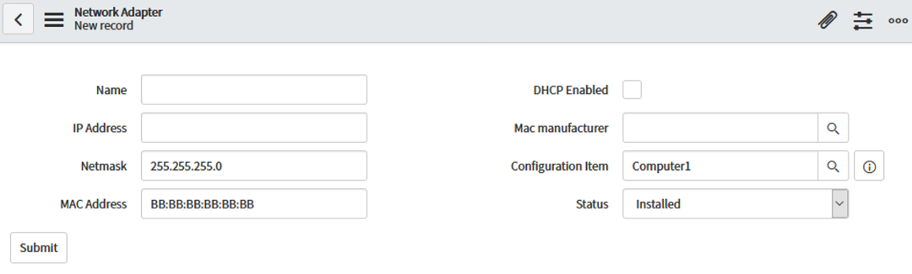

After clicking "Submit", recall that this is an Insertion into the Network Adapter table, so therefore the Business Rule will be triggered on the backend. After a few moments, you will see the result of the API calls:

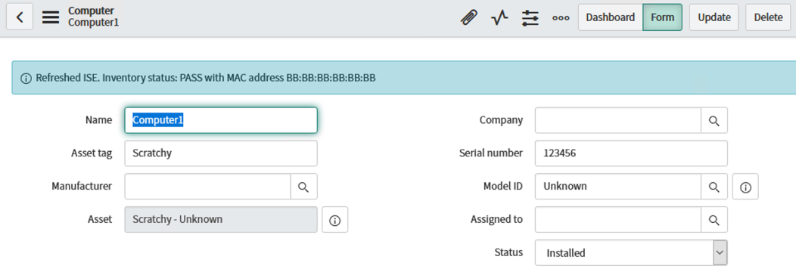

In this case, we see the "PASS" for the update of the MAC address of "BB:BB:BB:BB:BB:BB".

Again, verify in ISE by going to Context Visibility -> Endpoints and view the details of that MAC address.

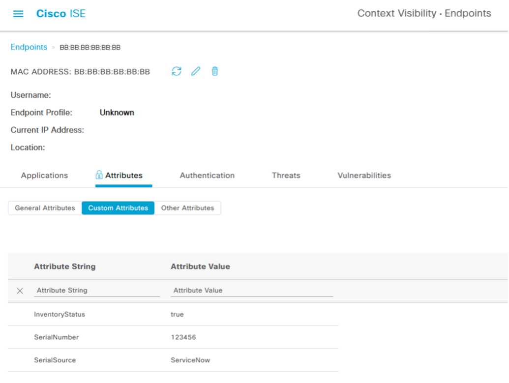

As soon as the device re-authenticates, it will now hit the Policy Condition that we created earlier that will check the "InventoryStatus = true". **NOTE**: This does not happen automatically. The client re-auth can either be initiated by the client (disconnect/reconnect, or timed re-auth), or manually triggered CoA by an admin through the ISE Admin console.

In this case, we were using a test MAC address so we can't show the live logs of this MAC, but here is an example of an actual device who's access was modified by this same process after re-authentication:

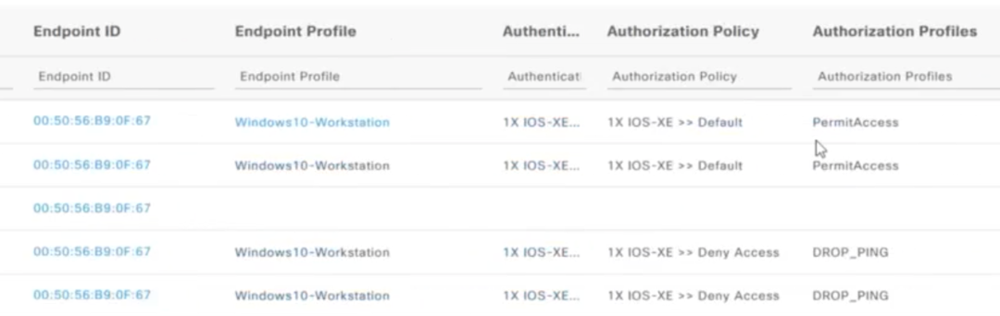

## TROUBLESHOOTING

**Scenario 1 - ISSUE**: ServiceNow updates ISE fields, but sets InventoryStatus to "False" instead of "True".

**Scenario 1 - SOLUTION:** Verify that the computer object within ServiceNow has a Status value set to "Installed". The Script Class is configured to utilize this property when updating NICs. This means that if you have the variable set to another value, (ex. Absent), then ServiceNow will interpret this as an object that is not in the inventory. For example, the Computer object below would update SerialNumber details, but set Inventory Status to "False"

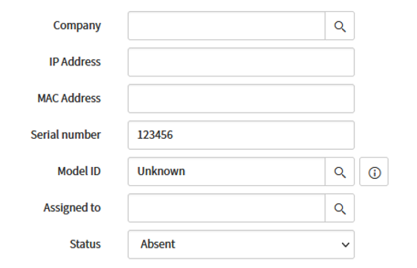 

Also, the message dialog after an ISE update should reflect this behavior with "Inventory Status: FAIL"

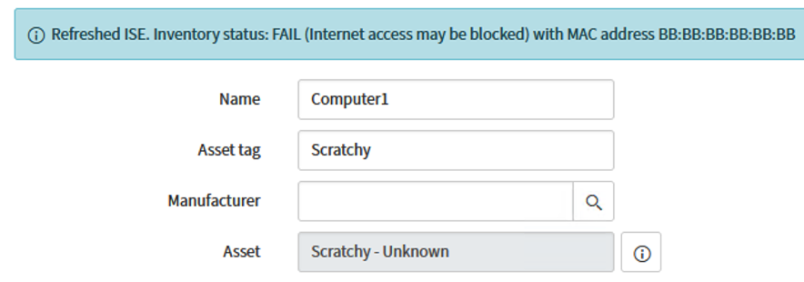

**Scenario 2 - ISSUE**: Receive "No response" for ECC Message Request within ServiceNow

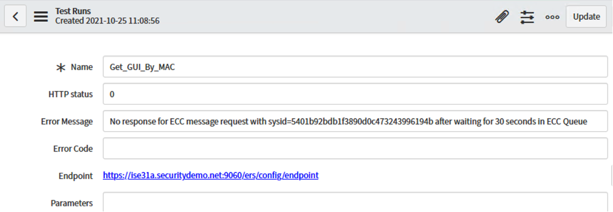

**Scenario 2 - SOLUTION**: Verify that the MID Server associated to the ISE REST messages is currently in a running state.

Navigate to Outbound -> REST Message -> ISE_Helper -> Get_GUI_By_MAC method

Click on the "HTTP Request Tab" and next to USE MID Server, hover over the "Info" button to see the current status of the MID Server.

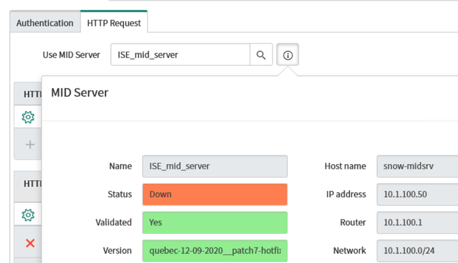

If the Server Status is "Down" but you have verified the box is online, make sure the MID Service is running on the Server (Start -> Services -> ServiceNow MID Server_ISE_<name>)

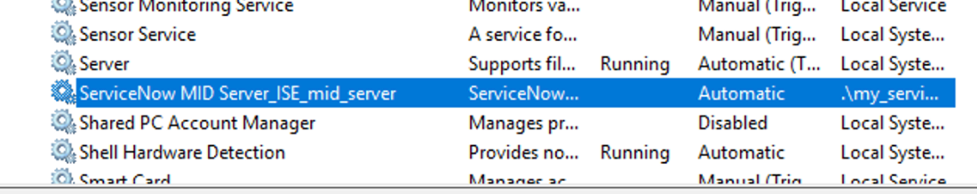

**If the service is not running, right click and select "Start". Wait a few moments, refresh the ServiceNow page and check the status again:**
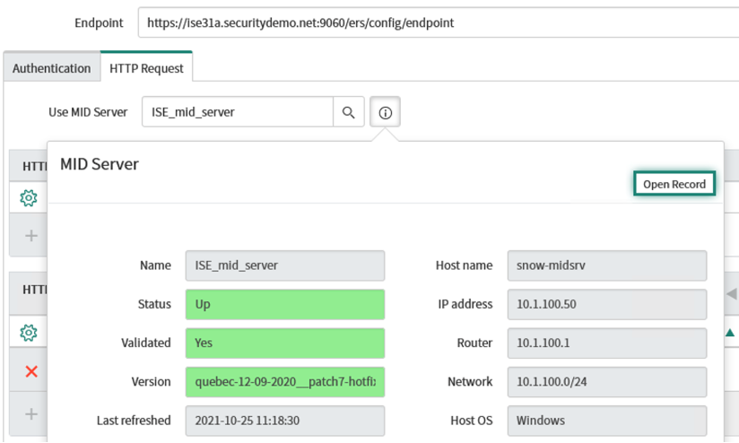

**Scenario 3**: Receive HTTP response other than 200.

**SOLUTION** : Verify configuration of required queries/headers for REST message.  Recreate/debug with Postman as necessary.

## AUTHOR

Taylor Cook (Cisco)